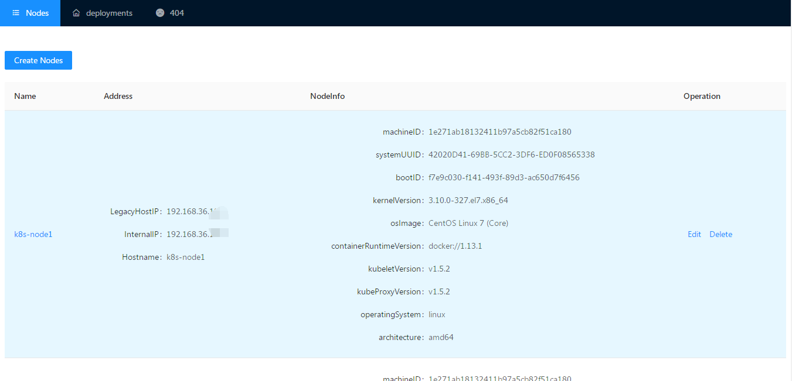

# dva-k8s-dashboard
最近想学习一下k8s apiserver的数据接口和react开发，当看到阿里大神的dva+antd的这个示例项目，就决定动手以其为原型参考，作为一个学习项目认真学习了。
```
原文[《12 步 30 分钟，完成用户管理的 CURD 应用 (react+dva+antd)》](https://github.com/sorrycc/blog/issues/18)。
```
---

<p align="center">
  
</p>

## Getting Started
```
cd example/user-dashboard
```

Install dependencies.

```bash
$ npm install
```

Start server.

```bash
$ npm start
```

If success, app will be open in your default browser automatically.
